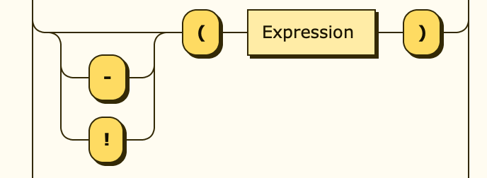

# MinimalParser

## Table of Contents
- [Grammar](#grammar)
  - [Numbers](#numbers)
  - [Strings](#strings)
  - [Literals](#literals)
  - [Identifiers](#identifiers)
  - [Operators](#operators)
  - [Parentheses](#parentheses)

## Grammar

### Numbers

There are two types of numbers, floating point as well as whole integers.

We start out by defining what a single digit has to look like:

```ebnf
Digit ::= [0-9]
```


Multiple digits in combination with an optional, leading minus sign compose an integer.

```ebnf
Integer ::= "-"? Digit+
```


If the number contains a decimal, it's a float. It may omit the zero right before the dot.

```ebnf
Float ::= "-"? Digit* "." Digit+
```


### Strings

A string is always surrounded by two double-quotes `"` and may only contain characters other than
double-quotes. To add a double-quote character without closing the string, it has to be escaped `\"`.
Since YAML strings can be cumbersome when it comes to single-quotes, `\s` will be replaced by a single-quote `'`.

```ebnf
String ::= '"' ('\"' | [^"] | "\s")* '"'
```


### Literals

A literal is a fixed value represented by a human-readable word. These words are reserved and cannot be used as identifiers.

```ebnf
Literal ::= "true" | "false" | "null"
```


### Identifiers

An identifier is either a function name, a variable name or a lookup table name. These names are provided by the
evaluation context, may only start with letters and can only consist of letters, digits and underscores.

```ebnf
Letter ::= [A-Za-z]
Identifier ::= Letter (Digit | Letter | '_')*
```


### Operators

In order to not have to call functions for simple operations and to improve on readability,
some of the most used operators have been implemented. Operators are listed top to bottom, in descending precedence.

| Operator                    | Example | Description                                          | Precedence |
|-----------------------------|---------|------------------------------------------------------|------------|
| (...)                       | (5 + 3) | Parentheses have the highest possible precedence     | 0          |
| **Negation Operator**       |
| not                         | not A   | Yields the inverse of A                              | 1          |
| **Exponentiation Operator** |
| ^                           | A ^ B   | Yields A to the power of B                           | 2          |
| **Multiplicative Operator** |
| *                           | A * B   | Yields the product of A and B                        | 3          |
| /                           | A / B   | Yields the quotient of A and B                       | 3          |
| %                           | A % B   | Yields the remainder of dividing A by B              | 3          |
| **Additive Operator**       |
| +                           | A + B   | Yields the sum of A and B                            | 4          |
| -                           | A - B   | Yields the difference of A and B                     | 4          |
| **Comparison Operator**     |
| \>                          | A \> B  | Yields `true` if A is greater than B                 | 5          |
| <                           | A < B   | Yields `true` if A is less than B                    | 5          |
| \>=                         | A \>= B | Yields `true` if A is greater than or equal to B     | 5          |
| <=                          | A <= B  | Yields `true` if A is less than or equal to B        | 5          |
| **Equality Operator**       |
| ==                          | A == B  | Yields `true` if A and B equal ignoring casing       | 6          |
| ===                         | A === B | Yields `true` if A and B equal exactly               | 6          |
| !=                          | A != B  | Yields `true` if A and B don't equal ignoring casing | 6          |
| !==                         | A !== B | Yields `true` if A and B don't equal exactly         | 6          |
| **Conjunction Operator**    |
| and                         | A and B | Yields `true` if both A and B yield `true`           | 7          |
| **Disjunction Operator**    |
| or                          | A or B  | Yields `true` if either A or B yields `true`         | 8          |
| **Concatenation Operator**  |
| &                           | A & B   | Concatenates the contents of A and B                 | 9          |

### Parentheses

To enforce a desired order of operations, expressions may be wrapped in parentheses. There is no limit for how many
parentheses the input can contain, they just need to be balanced (every opening parenthesis has to be closed later
down the expression again). While `5 + 2 * 5` would produce 15, `(5 + 2) * 5` will yield 35.

The expression within parentheses can be modified by prepending an operator right before it. The following operators
are available as parenthesis modifiers:

| Operator | Example      | Description                                         |
|----------|--------------|-----------------------------------------------------|
| -        | -(1 + 2)     | Flips the sign of the parentheses expression result |
| not      | not (a && b) | Inverts the boolean parentheses expression result   |


