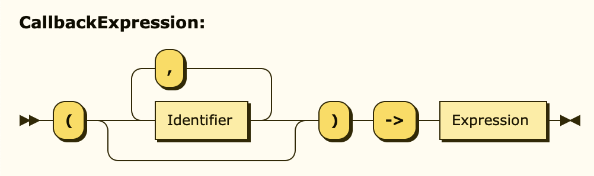

# GPEEE


The opensource `General Purpose Environment Expression Evaluator` which you most definitely
want to integrate into your next project. It's pronounced "cheapy", matching it's slim technical
cost when comparing against a project without `GPEEE`.

## Table of Contents
- [Mission Statement](#mission-statement)
- [How It Works](#how-it-works)
  - [Evaluator API](#evaluator-api)
  - [The Evaluation Environment](#the-evaluation-environment)
  - [Expression Values](#expression-values)
  - [Resolving Variables](#resolving-variables)
  - [Calling Functions](#calling-functions)
  - [Callback Functions](#callback-functions)
  - [Terminal Values](#terminal-values)
- [Grammar](#grammar)
  - [Numbers](#numbers)
  - [Strings](#strings)
  - [Literals](#literals)
  - [Identifiers](#identifiers)
  - [Operators And Precedences](#operators-and-precedences)
  - [Parentheses](#parentheses)
  - [Function Invocation](#function-invocation)
  - [Complete Definition](#complete-definition)

## Mission Statement

While this *is* a general purpose evaluator, it has been designed to solve a very specific problem
many bukkit plugin developers face: Allowing the user to easily describe dynamic and possibly complex
behavior inside a *YAML* configuration file. Many successful projects offer such a feature, but - at least
to my knowledge - they all painstakingly implement their own evaluator. Not only does this suck for
the end user who has to learn a million different flavors for basic operation expressions, but it also
heavily constrains lots of plugin developers who don't know how to write a parser in the user experience
of their software.

In order to keep this already pretty complex project as dead simple as possible, I've set a few
main guidelines in stone:

* Very clean, maintainable and well documented codebase to make it accessible for everyone
* Implement all generally known operators but **don't** add anything fancy
* Expressions will **not** keep any state (no variable declarations, etc)
* Next to basic terminal values and operators there will be **no** keywords
* **All** control flow and complex logic will be outsourced to Java and hidden behind functions

Without adhering to these, I'm sure the project would grow into an unmaintainable beast of "one more
feature please" in no time. The restrictions may seem harsh, but you're still able to get up and
running with all customizations by defining your own *evaluation environment* exactly to your needs
in no time.

## How It Works

The working principle of this evaluator is as simple as it gets: You provide an *evaluation environment*
as well as a string containing the target expression and the evaluator returns an *evaluation result* or
throws an error to be properly handled by the caller.

### Evaluator API

```java
public interface IExpressionEvaluator {

  /**
   * Parses an input string into an abstract syntax tree (AST) to be evaluated
   * later on and possibly be reused for multiple evaluations with multiple environments.
   * @param input Input to parse
   * @return Root node of the AST
   * @throws AParserError Error during the parsing process
   */
  AExpression parseString(String input) throws AParserError;

  /**
   * Evaluates a previously parsed expression within a provided evaluation environment.
   * @param expression Expression to evaluate
   * @return Resulting expression value
   * @throws AInterpreterError Error during the interpretation process
   */
  ExpressionValue evaluateExpression(AExpression expression, IEvaluationEnvironment environment) throws AInterpreterError;

}
```

### The Evaluation Environment

An *evaluation environment* consists of the following properties:

```java
public interface IEvaluationEnvironment {

  /**
   * Mapping identifiers to available functions which an expression may invoke
   */
  Map<String, IExpressionFunction> getFunctions();

  /**
   * Mapping identifiers to available live variables which an expression may resolve
   */
  Map<String, Supplier<Object>> getLiveVariables();

  /**
   * Mapping identifiers to available static variables which an expression may resolve
   */
  Map<String, Object> getStaticVariables();

}
```

An `identifier` is basically a unique name which can be used inside of expressions and underlies these
[constraints](#identifiers). The only difference between live variables and static variables is that a
live variable will be resolved by calling the supplier function while a static variable has to be set
in stone ahead of time.

An *expression function* can be easily created by adhering to the following signature:

```java
@FunctionalInterface
public interface IExpressionFunction {

  /**
   * Called whenever a function call to the registered corresponding
   * identifier is performed within an expression
   * @param args Arguments supplied by the invocation
   * @return Return value of this function
   */
  ExpressionValue apply(ExpressionValue[] args);

}
```

### Expression Values

As you might have already noticed, all input and output in regard to the evaluator's API takes place using
the *expression value*. The main reason for using this wrapper is the dynamically typed nature of expressions. There
are many conversion methods available to create, read and use these values in your own codebase.

### Resolving Variables

A variable is resolved as soon as you write out an `identifier` that's available in the current environment.

### Calling Functions

You should have a look at the exact [grammar](#function-invocation) of a function invocation. Summary: Provide an identifier,
open a parenthesis, specify 0-n parameters (which can be expressions too) and close the parenthesis again. Something like this:
`myFunction("hello world", 1, .3, null, true, false)`.

### Callback Functions

You should have a look at the exact [grammar](#callback-function) of a callback function. Summary: Open a parenthesis,
specify 0-n parameters, close the parenthesis again, write an arrow operator and follow that up by an expression. Something like this:
`foreach(items, (index) -> "index=" & index, "\n")`.

### Terminal Values

Terminal values are immediate values which do not resolve any further and are set in stone from the
point of writing them within the expression onwards.

| Type    | Example                                    |
|---------|--------------------------------------------|
| Integer | 1, -1                                      |
| Float   | .1, -.1, 3.1415                            |
| String  | "Escaped \\" double- and \s single quote " |
| Boolean | true, false                                |
| Null    | null                                       |

## Grammar

### Numbers

There are two types of numbers, floating point as well as whole integers.

We start out by defining what a single digit has to look like:

```ebnf
Digit ::= [0-9]
```


Multiple digits in combination with an optional, leading minus sign compose an integer.

```ebnf
Integer ::= "-"? Digit+
```


If the number contains a decimal, it's a float. It may omit the zero right before the dot.

```ebnf
Float ::= "-"? Digit* "." Digit+
```


### Strings

A string is always surrounded by two double-quotes `"` and may only contain characters other than
double-quotes. To add a double-quote character without closing the string, it has to be escaped `\"`.
Since YAML strings can be cumbersome when it comes to single-quotes, `\s` will be replaced by a single-quote `'`.

```ebnf
String ::= '"' ('\"' | [^"] | "\s")* '"'
```


### Literals

A literal is a fixed value represented by a human-readable word. These words are reserved and cannot be used as identifiers.

```ebnf
Literal ::= "true" | "false" | "null"
```


### Identifiers

An identifier is either a function name, a variable name or a lookup table name. These names are provided by the
evaluation context, may only start with letters and can only consist of letters, digits and underscores.

```ebnf
Letter ::= [A-Za-z]
Identifier ::= Letter (Digit | Letter | '_')*
```


### Operators And Precedences

In order to not have to call functions for simple operations and to improve on readability,
some of the most used operators have been implemented. Operators are listed top to bottom, in descending precedence.

| Operator                    | Example | Description                                          | Precedence |
|-----------------------------|---------|------------------------------------------------------|------------|
| (...)                       | (5 + 3) | Parentheses have the highest possible precedence     | 0          |
| **Negation Operator**       |
| not                         | not A   | Yields the inverse of A                              | 1          |
| **Exponentiation Operator** |
| ^                           | A ^ B   | Yields A to the power of B                           | 2          |
| **Multiplicative Operator** |
| *                           | A * B   | Yields the product of A and B                        | 3          |
| /                           | A / B   | Yields the quotient of A and B                       | 3          |
| %                           | A % B   | Yields the remainder of dividing A by B              | 3          |
| **Additive Operator**       |
| +                           | A + B   | Yields the sum of A and B                            | 4          |
| -                           | A - B   | Yields the difference of A and B                     | 4          |
| **Comparison Operator**     |
| \>                          | A \> B  | Yields `true` if A is greater than B                 | 5          |
| <                           | A < B   | Yields `true` if A is less than B                    | 5          |
| \>=                         | A \>= B | Yields `true` if A is greater than or equal to B     | 5          |
| <=                          | A <= B  | Yields `true` if A is less than or equal to B        | 5          |
| **Equality Operator**       |
| ==                          | A == B  | Yields `true` if A and B equal ignoring casing       | 6          |
| ===                         | A === B | Yields `true` if A and B equal exactly               | 6          |
| !=                          | A != B  | Yields `true` if A and B don't equal ignoring casing | 6          |
| !==                         | A !== B | Yields `true` if A and B don't equal exactly         | 6          |
| **Conjunction Operator**    |
| and                         | A and B | Yields `true` if both A and B yield `true`           | 7          |
| **Disjunction Operator**    |
| or                          | A or B  | Yields `true` if either A or B yields `true`         | 8          |
| **Concatenation Operator**  |
| &                           | A & B   | Concatenates the contents of A and B                 | 9          |

### Parentheses

To enforce a desired order of operations, expressions may be wrapped in parentheses. There is no limit for how many
parentheses the input can contain, they just need to be balanced (every opening parenthesis has to be closed later
down the expression again). While `5 + 2 * 5` would produce 15, `(5 + 2) * 5` will yield 35.

The expression within parentheses can be modified by prepending an operator right before it. The following operators
are available as parenthesis modifiers:

| Operator | Example      | Description                                         |
|----------|--------------|-----------------------------------------------------|
| -        | -(1 + 2)     | Flips the sign of the parentheses expression result |
| not      | not (a && b) | Inverts the boolean parentheses expression result   |


### Function Invocation

Functions are provided by the evaluation context and arbitrarily many may be called an arbitrary amount of times within
the expression. Prepending the invocation with a minus sign will flip the function return value's sign. An invocation is defined like this:

```ebnf
FunctionInvocationExpression ::= "-"? Identifier "(" (Expression | (Expression ("," Expression)*))? ")"
```


### Callback Function

A callback function is an expression which can be programmatically evaluated within a Java function which has been invoked by an
expression. This way, a back and forth type data flow becomes possible.

Callbacks may have an arbitrary amount of parameters which then at runtime become available within the expression
noted after the arrow operator.

```ebnf
CallbackExpression ::= "(" (Identifier | (Identifier ("," Identifier)*))? ")" "->" Expression
```



### Complete Definition

The following [EBNF](https://www.w3.org/2001/06/blindfold/grammar) defines the whole grammar which this parser understands:

```ebnf
Digit ::= [0-9]
Letter ::= [A-Za-z]

Int ::= "-"? Digit+
Float ::= "-"? Digit* "." Digit+
String ::= '"' ('\"' | [^"] | "\s")* '"'
Identifier ::= Letter (Digit | Letter | '_')*
Literal ::= "true" | "false" | "null"

AdditiveOperator ::= "+" | "-"
MultiplicativeOperator ::= "*" | "/" | "%"
EqualityOperator ::= "==" | "!=" | "===" | "!=="
ComparisonOperator ::= ">" | "<" | ">=" | "<="

PrimaryExpression ::= Int | Float | String | Identifier | Literal
NegationExpression ::= "not"? PrimaryExpression
ExponentiationExpression ::= NegationExpression ("^" NegationExpression)*
MultiplicativeExpression ::= ExponentiationExpression (MultiplicativeOperator ExponentiationExpression)*
AdditiveExpression ::= MultiplicativeExpression (AdditiveOperator MultiplicativeExpression)*
ComparisonExpression ::= AdditiveExpression (ComparisonOperator AdditiveExpression)*
EqualityExpression ::= ComparisonExpression (EqualityOperator ComparisonExpression)*
ConjunctionExpression ::= EqualityExpression ("and" EqualityExpression)*
DisjunctionExpression ::= ConjunctionExpression ("or" ConjunctionExpression)*
ConcatenationExpression ::= DisjunctionExpression ("&" DisjunctionExpression)*

Expression ::= ConcatenationExpression | ("-" | "not")? "(" Expression ")"

FunctionInvocationExpression ::= "-"? Identifier "(" (Expression | (Expression ("," Expression)*))? ")"
CallbackExpression ::= "(" (Identifier | (Identifier ("," Identifier)*))? ")" "->" Expression
```
